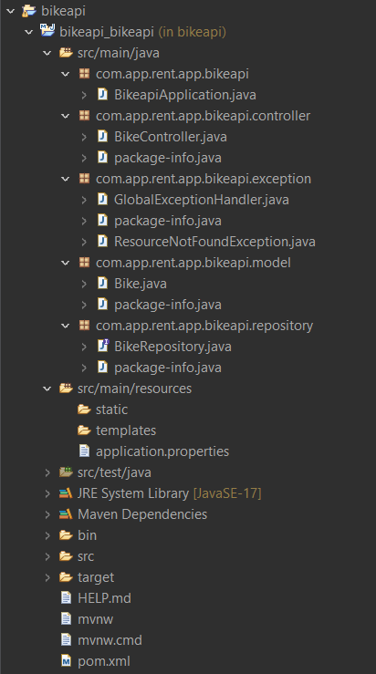
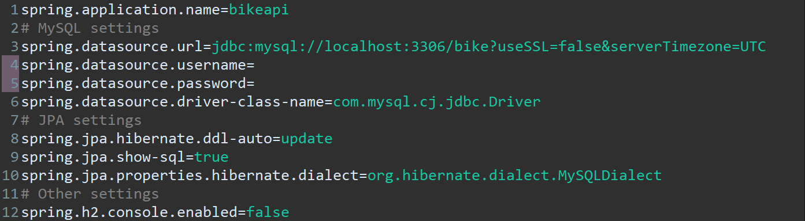
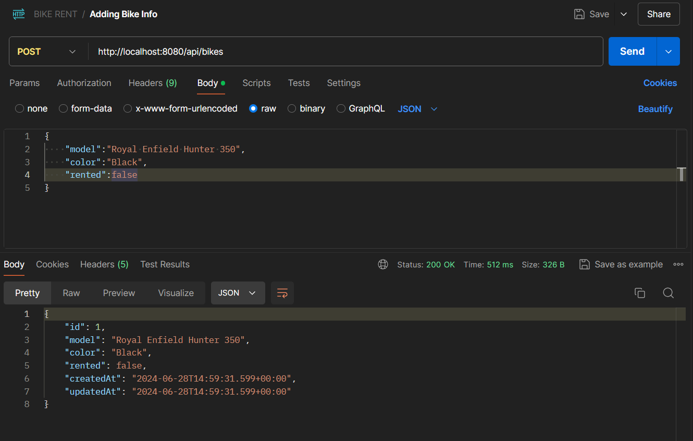
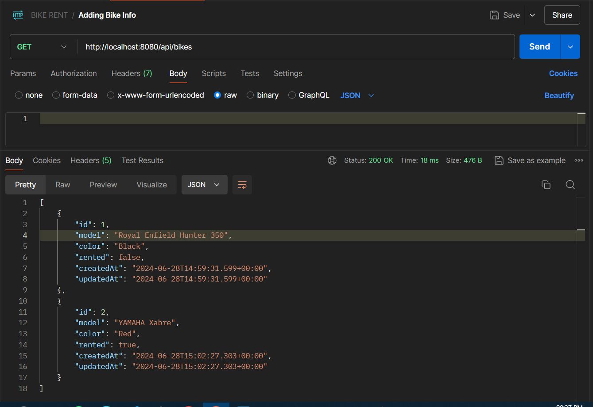
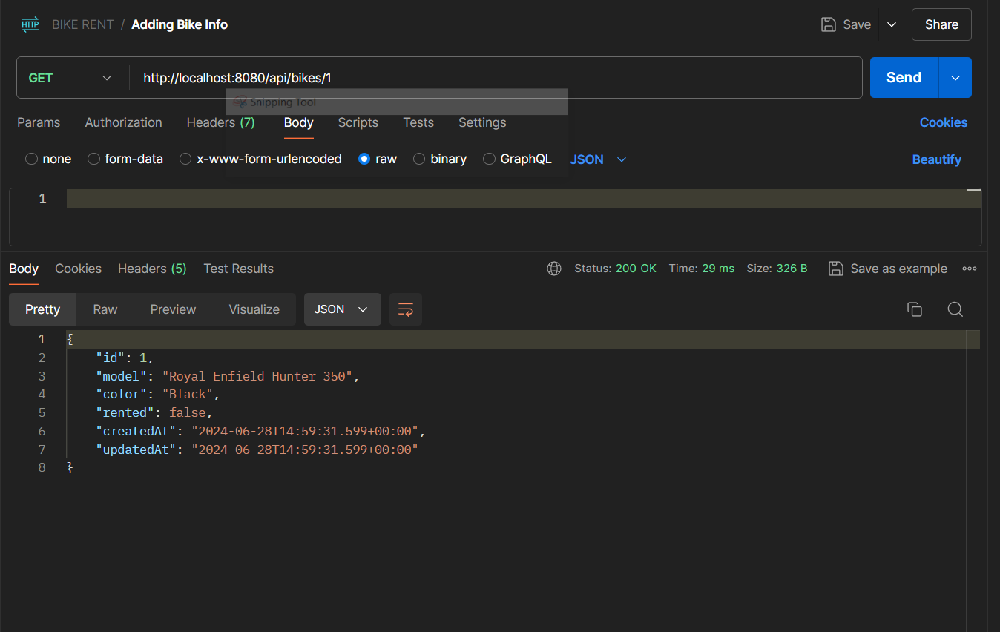
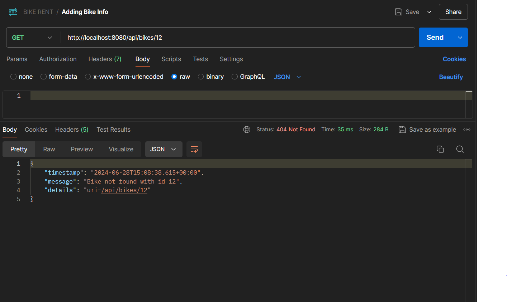
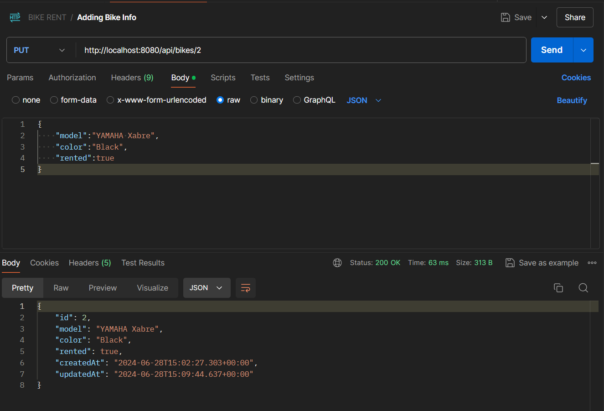
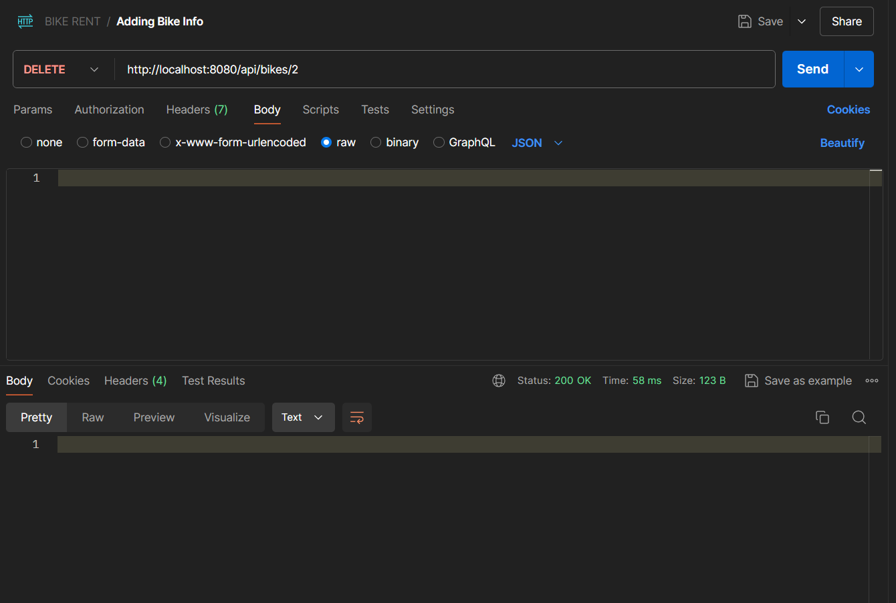

<h1>About This Program</h1>

This is a simple REST API for Bike Rental Service created using  Spring Boot and MySQL. It includes
<ul>
  <li>Adding Bike Information, including rental status.</li>
  <li>Fetching Information Of All Bikes.</li>
  <li>Fetching Information Of A Particular Bike.</li>
  <li>Updation Bike Information.</li>
  <li>Deleting Bike Information.</li>
</ul>
  Methods, End Points And Description Are Given Below.

<h1>API KEYS</h1>

<table>
<r>
  <th><h3>METHOD</h3></th>
   <th><h3>ENDPOINT</h3></th>
  <th><h3>DESCRIPTION</h3></th>
</r>
<tr>
<td>POST</td>
<td>http://localhost:8080/api/bikes</td>
<td>User Can Add New Bike Information.</td>
</tr>
<tr>
<td>GET</td>
<td>http://localhost:8080/api/bikes</td>
  <td>Fetch All The Bike Information.</td>
</tr>
  <tr>
<td>GET</td>
<td>http://localhost:8080/api/bikes/{id}</td>

 <td>Fetch Information Of A Particular Bike Using ID.</td>
</tr>
<tr>
<td>PUT</td>
<td>http://localhost:8080/api/bikes/{id}</td>
  <td>Update Information Of A Particular Bile Uding ID.</td>
</tr>
<tr>
<td>DELETE</td>
<td>http://localhost:8080/api/bikes/{id}</{id}td>
  <td>Delete The Bike Information Using ID.</td>
</tr>
  
</table>

<h1>1. Folder Structure</h1>

<h1>2. Set The Application Properties</h1>
 (For Mysql)

<h1>3. Adding New Bike Information Using POST Method</h1>

<h1>4. Displaying All Bike Information Using GET Method</h1>

<h1>5. Displaying A Particular Bike Information By Id Using GET Method</h1>

<h1>6. Showing Validation By Giving Wrong ID</h1>

<h1>7. Updating Bike Information By Id Using PUT Method</h1>

<h1>7. Deleting Bike Information By Id Using DELETE Method</h1>

<h1 style="color:red;">Abhishek Kumar</h1>

